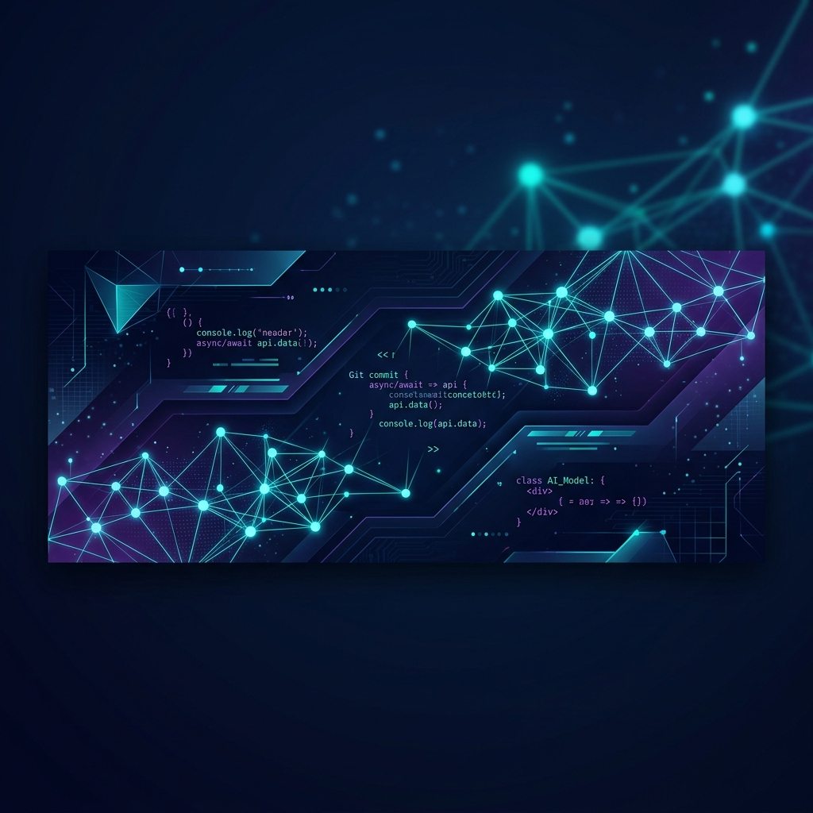

  

<h1 align="center">Hi, I'm Ahmed Sherif 👋</h1>

  

---

### 🚀 About Me
I am an **Artificial Intelligence graduate** and an **AI Engineer** passionate about building localized machine learning architectures, natural language processing pipelines, and intelligent automation systems. I love turning complex data challenges into clean, production-ready APIs and scalable workflows.

* 🔭 **Current Focus:** Developing localized Arabic text classification and handoff pipelines.
* 🌱 **Learning & Research:** Deepening my expertise in advanced computer vision and specialized natural language processing frameworks.
* 💬 **Ask me about:** Python, PyTorch, FastAPI, and workflow automation.
* ⚡ **Fun Fact:** When I'm not writing code, I love analyzing high-quality animation production and diving into competitive gaming.

---

### 🛠️ Tech Stack & Tools

<table>
  <tr>
    <td valign="top" width="50%">
      <strong>Languages & Core Frameworks:</strong>  
      
      
      
    </td>
    <td valign="top" width="50%">
      <strong>DevOps, OS & Automation:</strong>  
      
      
      
    </td>
  </tr>
</table>

---

### 📊 My GitHub Stats

  
  &nbsp;&nbsp;
  

  

---

### 🤝 Connect With Me

  

